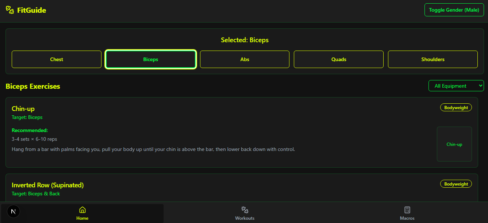
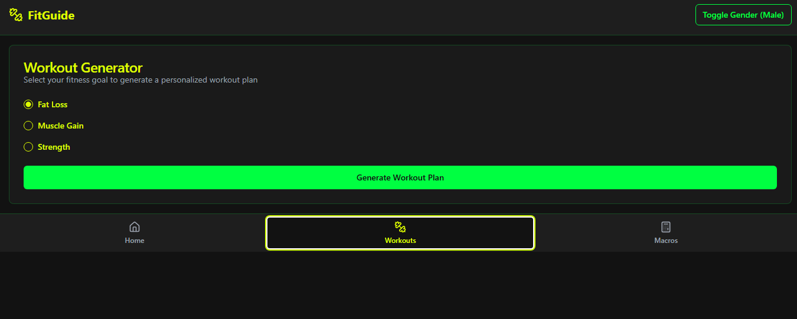
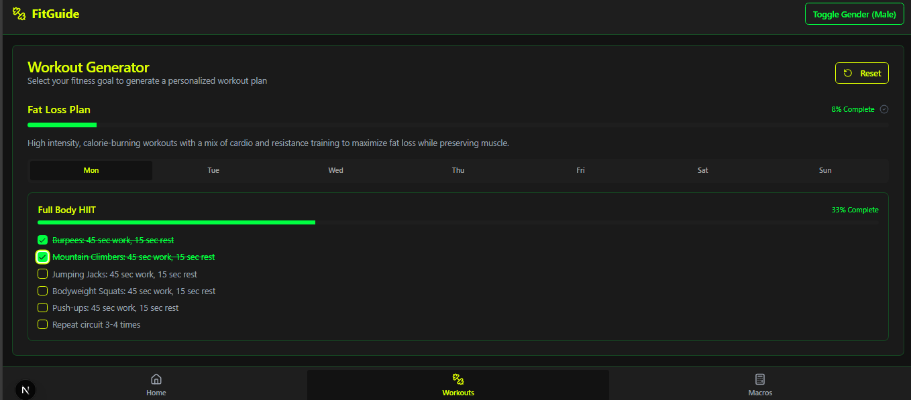
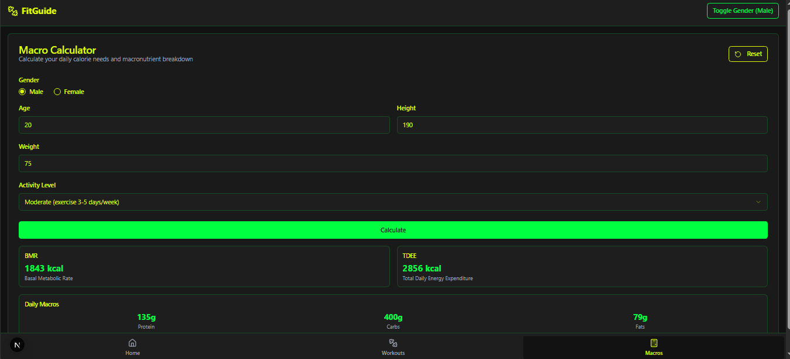

 
# Fitness App

## Project Information
The Fitness App is a modern web application designed to help users track their fitness goals, monitor progress, and stay motivated. Built with cutting-edge technologies, it provides an intuitive interface and seamless user experience.

### Features
- User-friendly dashboard for tracking workouts and progress.
- Integration with wearable devices for real-time data.
- Personalized fitness plans and recommendations.
- Social features to connect with friends and share achievements.

### Technologies Used
- **Frontend**: React, Tailwind CSS

## Images
Below are the images used in the project:

### App Interface

### Workout Tracker

### Features

